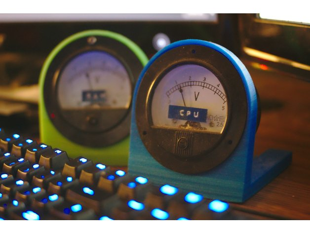

# FreeMeter

This repo contains the Arduino C code, Python based OS driver, and OpenSCAD designs for this [3D printable Analog CPU/RAM gauge project](https://www.thingiverse.com/thing:3484111).

# Usage

### Programming the Gauge Controller

Program your Arduino with the code found in **meter-arduino/meter-arduino.ino**

The Meter accepts a very basic serial protocol running at 9600 baud. 

### Host Requirements (Linux, Windows, Mac)

Install pyserial and psutil on your Linux, Windows, or Mac desktop. It would probably be better to install the dependencies in a python virtualenv, but for simplicity, I just install them globally.

    pip install -r requirements.txt

### Host/Meter Config

Open up **meter_config.yaml** in your favorite editor and modify it to suit your OS and meter setup.

##### Linux, 1 controller, 1 meter connected on pin 10

    meter1:
        port: '/dev/ttyUSB0'
        pins:
          10: CPU

##### Linux, 2 controllers, 3 meters

    meter1:
      port: /dev/ttyUSB0
      pins:
        10: CPU
        11: psutil.sensors_temperatures()['k10temp'][0].current/70 # CPU Temp (70 degrees max)
    meter2:
      port: /dev/ttyUSB1
      pins:
        11: RAM

##### Windows, 1 controller, 2 meters connected on pins 10 and 11

    meter1:
        port: 'COM3'
        pins:
          10: CPU
          11: RAM

##### Mac

I haven't tried it on a Mac but I think you can just use **/dev/tty.usbserial0** as the port and use brew to install python and pip.

### Custom Metrics

Using psutil, metrics like CPU Fan Speed and Temperature can be accessed but only through hardware/platform specific data structures.

In this example, I'm reading CPU Fan speed and CPU Temperature on my ancient ASUS M5A97 motherboard. The Python code simply runs an eval() on whatever string you run here. 

    meter:
        port: /dev/ttyUSB0
        pins:
          10: psutil.sensors_fans()['it8721'][0].current/2000.0 # CPU Fan (2000 rpm max)
          11: psutil.sensors_temperatures()['k10temp'][0].current/70 # CPU Temp (70 degrees max)

### Running the host driver

Now that you've installed the dependencies and modified the config file, just run the 'meter' script:

    python meter
